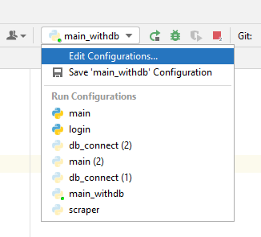
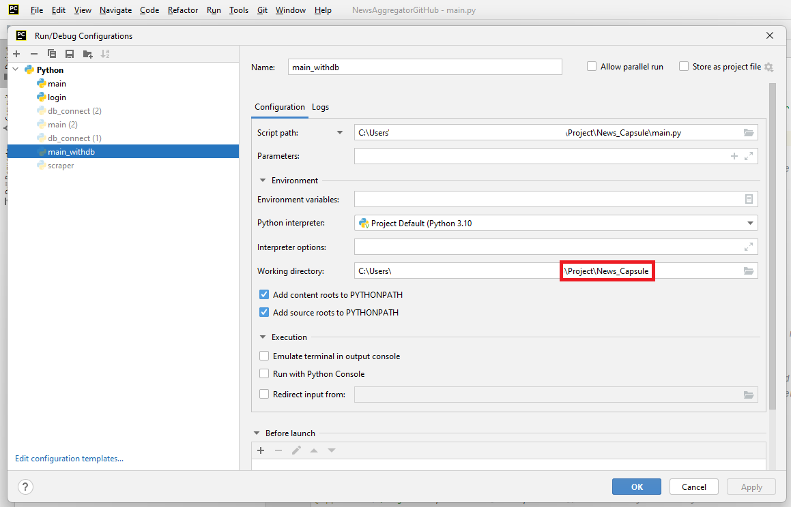
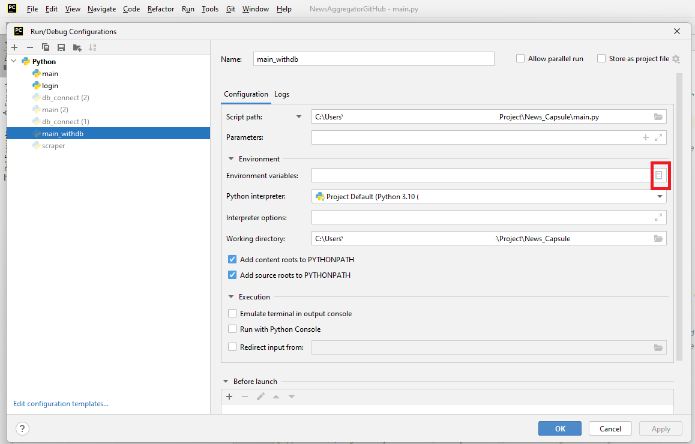
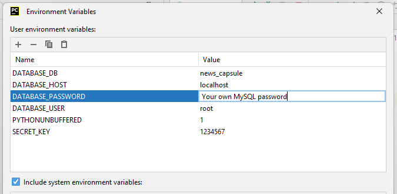

## Project: News Capsule

Helping to reach the technology news fast and easy. Project made during CFGdegree.

My contribution: front-end for the project (HTML, CSS and JS) + core code for login and register features, including hashing the passwords. 

## How to run

To run this application, please create a new virtual environment in PyCharm and install the packages in the requirements.txt file

In your PyCharm configuration, please set the working directory to the "Project\News_Capsule" directory.

Please add the following environment variables to connect the app with MySQL (please note: the value of DATABASE_PASSWORD should be your own MySQL password)

DATABASE_DB=news_capsule  
DATABASE_HOST=localhost  
DATABASE_PASSWORD=your own MySQL password  
DATABASE_USER=root  
PYTHONUNBUFFERED=1  
SECRET_KEY=1234567  

Create the news_capsule database by executing the whole script available at \Project\News_Capsule\SQL_DB_Creation_Queries\news_capsule_DB.sql in your MySQL.

Proceed to run the application by executing the main.py file (Project\News_Capsule\main.py)
